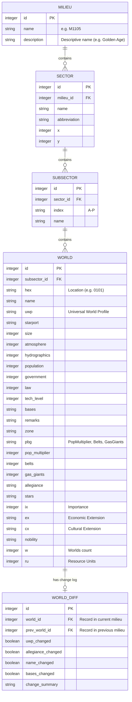

# Traveller Map SQLite Database Documentation

This document describes the schema and operational overview of the `traveller_map.db` database, which contains consolidated sector data for 10 milieux, including Early Imperium, Golden Age, Rebellion, and Galaxiad eras.

## 📊 Dataset Statistics (Final Verified)

| Milestone | Era Name | Sectors | Worlds |
| :--- | :--- | :--- | :--- |
| **M0** | Early Imperium | 12 | 5,922 |
| **M1105** | Golden Age | 290 | 42,617 |
| **M1120** | Rebellion | 29 | 7,502 |
| **M1900** | Galaxiad | 38 | 11,933 |
| **Other OTU** | Deepnight, IW, M600, etc. | 222 | 75,666 |
| **TOTAL** | | **591** | **143,640** |

- **Cross-Era Record Diffs**: 16,613
- **Data Fidelity**: 100% Name/Remark capture via column-aware parsing.

## 🛠️ Data Integrity & Parsing

The database was built using a **robust column-aware parser** to ensure high fidelity for legacy and modern formats:

1. **Precision Slice Targeting**: Uses "dash line" legends (`---- ----`) to auto-detect column offsets, correctly handling Name-first (Legacy) and Hex-first (Second Survey) layouts.
2. **Extended Metadata Support**: Full extraction of Importance `{Ix}`, Economic `(Ex)`, and Cultural `[Cx]` extensions.
3. **Selective Priority**: Multi-milieu ingestion prioritizes `.tab` data over `.sec` files where both exist, ensuring the highest resolution data is used.
4. **Guaranteed XML Coverage**: Every sector listed in the official milieu XML files is attempted, provided a data file exists.

## 🗄️ Database Schema

The database is highly normalized to support efficient temporal analysis and world-level queries.



## 📋 Table Descriptions

- **MILIEU**: Defines the major eras/timeframes (M0, M1105, M1120, M1900).
- **SECTOR**: Represents a sector (32x40 hexes) within a specific milieu.
- **SUBSECTOR**: One of the 16 subsectors (A-P) within a sector.
- **WORLD**: Individual star systems. Detailed UWP and PBG fields are pre-parsed for easy querying.
- **WORLD_DIFF**: Stores deltas between chronological milestones for the same world location.

## 🐍 Python Access Example

You can use the built-in `sqlite3` library to access the data.

```python
import sqlite3

def get_high_tech_worlds(milieu_name="M1105", min_tl=12):
    """Retrieves worlds with high tech levels in a specific era."""
    conn = sqlite3.connect('traveller_map.db')
    cursor = conn.cursor()

    query = '''
        SELECT S.name as sector, W.hex, W.name, W.uwp, W.tech_level
        FROM WORLD W
        JOIN SUBSECTOR SS ON W.subsector_id = SS.id
        JOIN SECTOR S ON SS.sector_id = S.id
        JOIN MILIEU M ON S.milieu_id = M.id
        WHERE M.name = ? AND W.tech_level >= ?
        ORDER BY W.tech_level DESC
        LIMIT 10
    '''
    
    cursor.execute(query, (milieu_name, min_tl))
    results = cursor.fetchall()
    
    print(f"Top 10 High Tech Worlds in {milieu_name} (TL >= {min_tl}):")
    print("-" * 60)
    for row in results:
        print(f"{row[0]:<20} | {row[1]} | {row[2]:<15} | {row[3]} | TL {row[4]}")
    
    conn.close()

def get_world_history(sector_name, hex_val):
    """Shows the evolution of a specific world across all milieux."""
    conn = sqlite3.connect('traveller_map.db')
    cursor = conn.cursor()

    query = '''
        SELECT M.name, W.name, W.uwp, W.allegiance
        FROM WORLD W
        JOIN SUBSECTOR SS ON W.subsector_id = SS.id
        JOIN SECTOR S ON SS.sector_id = S.id
        JOIN MILIEU M ON S.milieu_id = M.id
        WHERE S.name = ? AND W.hex = ?
        ORDER BY M.id ASC
    '''
    
    cursor.execute(query, (sector_name, hex_val))
    results = cursor.fetchall()
    
    print(f"\nHistory of {sector_name} {hex_val}:")
    for row in results:
        print(f"{row[0]:<6} | Name: {row[1]:<12} | UWP: {row[2]} | Alleg: {row[3]}")
    
    conn.close()

if __name__ == '__main__':
    get_high_tech_worlds("M1105", 15)
    get_world_history("Spinward Marches", "1910")
```

## 💡 Query Tips

- **Filtering by Milieu**: Always join with the `MILIEU` table to ensure you are looking at the correct timeframe.
- **UWP Queries**: Use the integer columns (e.g., `tech_level`, `population`) for numeric comparisons rather than parsing the `uwp` string in SQL.
- **Tracking Changes**: Check the `WORLD_DIFF` table to find worlds that underwent specific transitions (e.g., `WHERE allegiance_changed = 1`).
